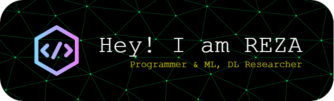

<h2 align="center">
💫 About Me:
</h2>

🌱 I’m currently learning Camtasia 👨‍💻 All of my projects are available at seyed-mohammadreza-mousavi 💬 Ask me about Deep learning, transformers and related technologies. 📫 How to reach me mohammadreza92299@gmail.com ⚡ Fun fact Fast-Food fanatic, Pizza.

<h2 align="center">
🌐 Follow me on:
</h2>

   )

<h3 align="center">
💻 Programming languages & Tools:
</h3>

                        

<h3 align="center">
💻 Certifications:
</h3>

- [Supervised Machine Learning: Regression and Classification](https://www.coursera.org/account/accomplishments/certificate/4EP92VRUZJYU) @ Coursera
  
- [Advance Your Skills in Deep Learning and Neural Networks](https://www.linkedin.com/learning/certificates/4d256cd0de8ca2f5d969ffd7d562655506271be2a1b6459b407f0a0da609f00c?lipi=urn%3Ali%3Apage%3Ad_flagship3_profile_view_base_certifications_details%3B5gpWzQFMT96gyK4Y1y7aFA%3D%3D) @ LinkedIn Learning
  
- [Deep Learning: Image Recognition](https://www.linkedin.com/in/seyed-mohammadreza-mousavi/details/certifications/) @ LinkedIn Learning
  
- [Machine Learning with Python: Foundations](https://www.linkedin.com/learning/certificates/16304fbd2924d13e8c4a836610b499b1500fa6ccaf1b9618ee332d011d63b246?lipi=urn%3Ali%3Apage%3Ad_flagship3_profile_view_base_certifications_details%3B5gpWzQFMT96gyK4Y1y7aFA%3D%3D) @ LinkedIn Learning
  

### Certifications 📜
- [Practical Reinforcement Learning (with honors)](https://www.coursera.org/account/accomplishments/certificate/AUVVSHZFH7XZ) @ Coursera
- [Introduction to Deep Learning (with honors)](https://www.coursera.org/account/accomplishments/certificate/D4VMH74AJHHK) @ Coursera
- [Bayesian Methods for Machine Learning (with honors)](https://www.coursera.org/account/accomplishments/certificate/5R62SGB3G6GF) @ Coursera
- [Hadoop. System for processing large amounts of data](https://stepik.org/cert/166893) @ Stepik

<h3 align="center">
🌐 Languages 
</h3>

| Language      | Proficiency                                                               |
| ------------- | ------------------------------------------------------------------------- |
| English       | C1 Advanced ([EFSET certified](https://www.efset.org/cert/XHq8M3))        |
| Persian       | Native language       

<h3 align="center">
📊 GitHub Stats:
</h3>

<h2 align="center">⚡ Reports ⚡</h2>
 

  

    
    
  

           
  

    
  

   

  

<!-- -->
<!-- -->
<!---->

😂 Meme of the day and some humor
</h4>

 
  
---

<!--### 🔝 Top Contributed Repo
-->

<!-- Proudly created with GPRM ( https://gprm.itsvg.in ) -->
